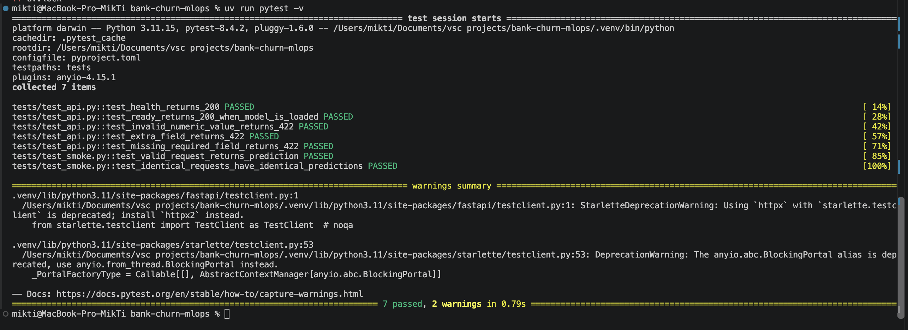
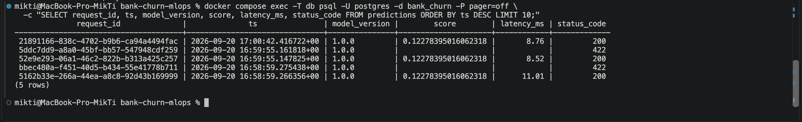
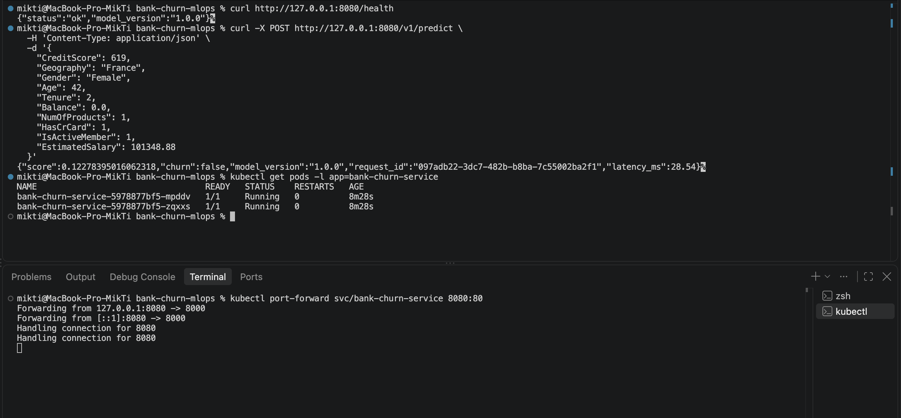
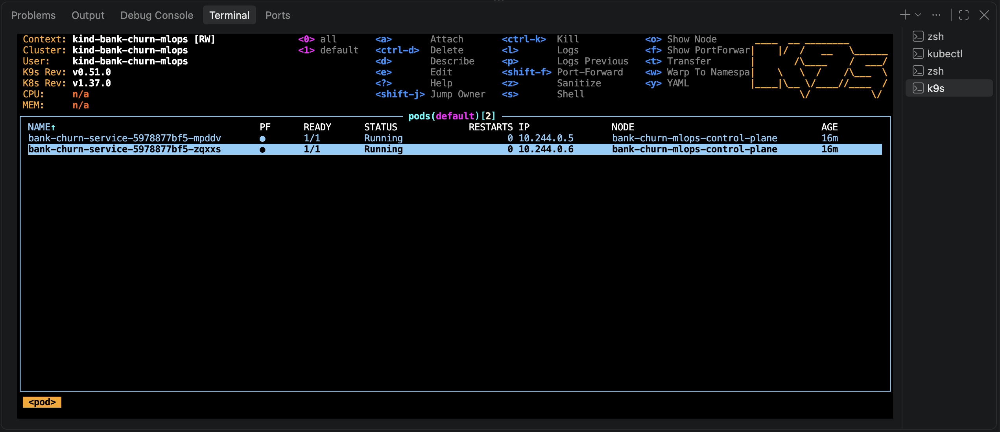

# Bank Churn MLOps

ML-сервис прогнозирования оттока банковских клиентов. Модель собрана в единый sklearn `Pipeline` с предобработкой, публикуется через FastAPI, записывает запросы в PostgreSQL и запускается локально через Docker Compose или в Kubernetes-кластере kind.

## Структура

- `src/bank_churn_mlops/` — обучение, предобработка, FastAPI и PostgreSQL-логирование.
- `artifacts/model.joblib` — Pipeline и паспорт модели.
- `notebooks/` — исходный анализ и воспроизводимый ноутбук обучения.
- `tests/` — contract, smoke, determinism и PostgreSQL integration-тесты.
- `k8s/` — Deployment на две реплики и ClusterIP Service.
- `screenshots/` — доказательства выполнения обязательных чекпоинтов.
- `REPORT.md` — итоговый отчёт и журнал реальных проблем.

## Предварительные требования

Нужны macOS или совместимая Unix-среда, Python 3.11, `uv`, Docker с запущенным daemon, Docker Compose, kind, kubectl и curl. k9s требуется только для визуального просмотра кластера и не участвует в автоматических проверках.

## Проверка после клонирования

Выполните из корня проекта ровно три команды сверху вниз.

1. Установить Python-зависимости из lock-файла и запустить тесты:

   ```bash
   uv sync && uv run pytest -v
   ```

2. Не перезаписывая существующие настройки, подготовить учебный `.env` и запустить API с PostgreSQL:

   ```bash
   { test -f .env || cp .env.example .env; } && docker compose up --build -d --wait
   ```

3. Создать kind-кластер при его отсутствии, собрать и загрузить образ, применить манифесты, дождаться двух готовых реплик и проверить API через порт 8080:

   ```bash
   bash scripts/check-kind.sh
   ```

## Доказательства обязательной части

### Pytest



### PostgreSQL



### Kubernetes и ответ модели через port-forward



### k9s



Подробные результаты, ограничения проверки и журнал проблем находятся в [REPORT.md](REPORT.md).

